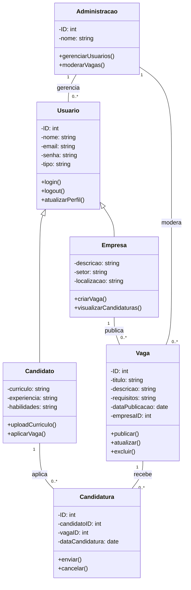
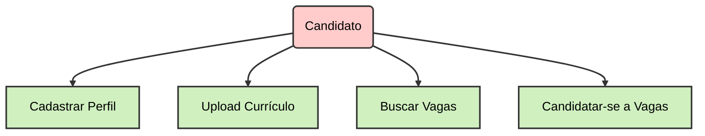
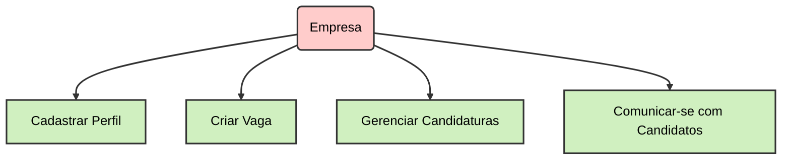
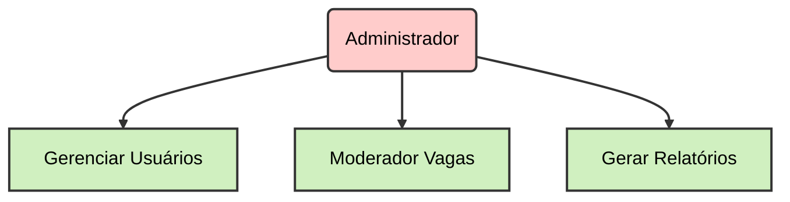
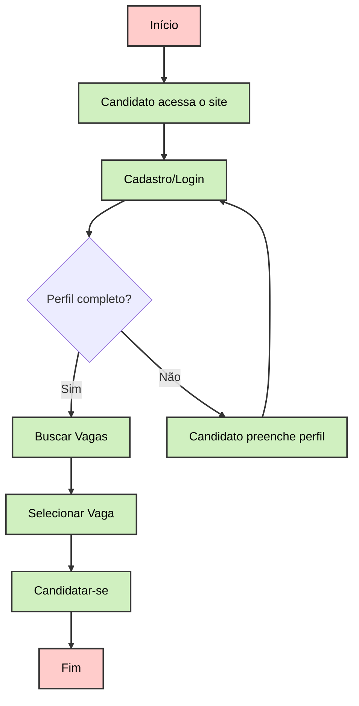
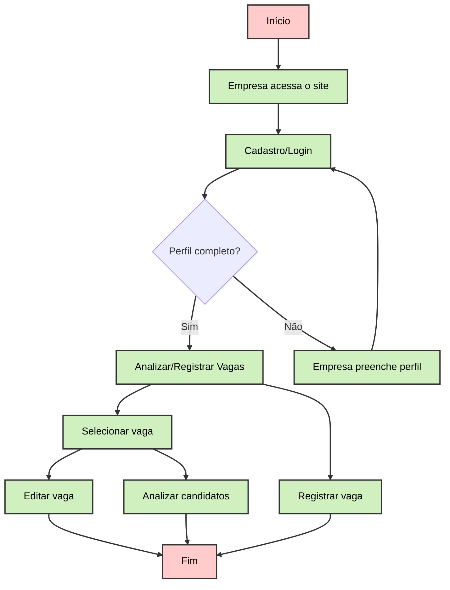

# Sistema Web de Gerenciamento de Empregos e Currículo

# **Escopo do Projeto**

## **Visão Geral do Projeto:**

Desenvolver um site de vagas de emprego que permita aos usuários (candidatos) cadastrar seus currículos, procurar e se candidatar a vagas, e às empresas, cadastrar suas informações e publicar oportunidades de emprego.

## **Funcionalidades Principais:**

- **Para Candidatos:**
    - Cadastro e gerenciamento de perfil (informações pessoais, experiência, habilidades).
    - Upload e atualização de currículos.
    - Pesquisa e visualização de vagas de emprego.
    - Candidatura às vagas de interesse.
- **Para Empresas:**
    - Cadastro e gerenciamento de perfil da empresa.
    - Criação e publicação de vagas de emprego.
    - Visualização e gerenciamento de candidaturas recebidas.
    - Comunicação com candidatos (mensagens, feedback).
- **Funcionalidades Administrativas:**
    - Gerenciamento de usuários (candidatos e empresas) pela equipe administrativa.
    - Moderação e aprovação de vagas e perfis.

## **Requisitos Técnicos:**

- Desenvolvimento de um site responsivo.
- Integração com bases de dados para armazenar informações de usuários e vagas.
- Sistema de autenticação e segurança.
- Funcionalidade de busca e filtros para vagas e currículos.
- Interface amigável e intuitiva.

## **Exclusões do Escopo:**

- Funcionalidades de integração com redes sociais ou plataformas externas.
- Desenvolvimento de aplicativos móveis (inicialmente, o foco será apenas no site).

# **Objetivos do Projeto**

## **Objetivos Específicos:**

1. **Cadastro e Gerenciamento de Perfil:**
    - Desenvolver funcionalidades para que candidatos e empresas possam criar e gerenciar seus perfis na plataforma.
2. **Publicação e Busca de Vagas:**
    - Permitir que empresas publiquem vagas e candidatos busquem e filtrem essas vagas conforme suas preferências e qualificações.
3. **Candidatura e Comunicação:**
    - Implementar um sistema que permita aos candidatos se candidatarem às vagas e recebam notificações, e que as empresas possam gerenciar e comunicar-se com os candidatos.

## **Objetivos Mensuráveis:**

1. **Cadastro de Usuários:**
    - Até o final do projeto, o sistema deve permitir o cadastro e gerenciamento de perfis para pelo menos 10.000 usuários (candidatos e empresas).
2. **Publicação de Vagas:**
    - No lançamento, o sistema deve suportar a publicação de pelo menos 1.000 vagas de emprego.
3. **Candidaturas:**
    - O sistema deve permitir que candidatos se candidatem a pelo menos 5.000 vagas no primeiro mês após o lançamento.
4. **Relatórios:**
    - Desenvolver pelo menos 5 tipos de relatórios administrativos sobre o uso da plataforma (e.g., número de vagas publicadas, número de candidaturas, etc.).

## **Objetivos Atingíveis:**

1. **Equipe e Recursos:**
    - Garantir uma equipe de desenvolvimento qualificada e recursos técnicos para implementar as funcionalidades desejadas no prazo estipulado.
2. **Tecnologia e Ferramentas:**
    - Utilizar ferramentas como Laravel (PHP) e PostgreSQL (Banco de dados relacional) para desenvolver a aplicação com facilidade.

## **Objetivos Relevantes:**

1. **Apoio ao Mercado de Trabalho:**
    - O sistema atenderá à necessidade de uma plataforma eficiente para conexão entre candidatos e empresas, facilitando o processo de recrutamento e buscando melhorar as oportunidades de emprego.
2. **Facilidade de Uso:**
    - Proporcionar uma interface intuitiva e de fácil navegação para garantir uma boa experiência tanto para candidatos quanto para empresas.

## **Objetivos Temporais:**

1. **Planejamento e Design:**
    - Completar a fase de planejamento e design em 1 mês.
2. **Desenvolvimento:**
    - Finalizar o desenvolvimento das principais funcionalidades em 4 meses.
3. **Testes e Ajustes:**
    - Concluir a fase de testes e ajustes em 1 mês.
4. **Lançamento:**
    - Lançar a plataforma no final de 6 meses a partir do início do projeto.

# **Cronograma de Desenvolvimento**

## **1. Planejamento e Design (1 mês)**

- **Semana 1:**
    - Reunião de Kick-off
    - Definição de Requisitos Detalhados
    - Criação do Documento de Requisitos e Funcionalidades
- **Semana 2:**
    - Pesquisa e Análise de Mercado
    - Criação de Wireframes e Protótipos
    - Aprovação dos Wireframes e Protótipos
- **Semana 3:**
    - Desenvolvimento do Design Visual (UI/UX)
    - Revisão e Feedback sobre o Design
- **Semana 4:**
    - Finalização do Design
    - Preparação para a Fase de Desenvolvimento

---

## **2. Desenvolvimento (4 meses)**

- **Mês 1:**
    - **Semana 1-2:**
        - Configuração do Ambiente de Desenvolvimento
        - Estruturação do Banco de Dados
        - Desenvolvimento das Funcionalidades de Cadastro e Gerenciamento de Perfil (Candidatos e Empresas)
    - **Semana 3-4:**
        - Implementação do Sistema de Autenticação e Segurança
        - Desenvolvimento das Funcionalidades de Upload e Atualização de Currículos
- **Mês 2:**
    - **Semana 1-2:**
        - Implementação das Funcionalidades de Pesquisa e Visualização de Vagas
        - Desenvolvimento da Funcionalidade de Candidatura a Vagas
    - **Semana 3-4:**
        - Desenvolvimento das Funcionalidades de Publicação de Vagas (para Empresas)
        - Implementação do Sistema de Comunicação entre Empresas e Candidatos
- **Mês 3:**
    - **Semana 1-2:**
        - Desenvolvimento das Funcionalidades Administrativas (Gerenciamento de Usuários e Moderação)
        - Implementação dos Filtros de Busca e Funcionalidade de Relatórios
    - **Semana 3-4:**
        - Integração das Funcionalidades
        - Revisão e Ajustes das Funcionalidades Desenvolvidas
- **Mês 4:**
    - **Semana 1-2:**
        - Implementação de Testes Unitários e de Integração
        - Correção de Bugs e Ajustes Baseados em Feedback Interno
    - **Semana 3-4:**
        - Preparação para a Fase de Testes e Ajustes
        - Documentação Técnica e Manual do Usuário

---

## **3. Testes e Ajustes (1 mês)**

- **Semana 1-2:**
    - Testes Funcionais e de Usabilidade
    - Identificação e Correção de Problemas
    - Testes de Segurança e Performance
- **Semana 3-4:**
    - Testes de Aceitação do Usuário (UAT)
    - Ajustes Finais e Correções
    - Preparação para o Lançamento

---

## **4. Lançamento (Final do 6º Mês)**

- **Semana 1:**
    - Preparação para o Lançamento
    - Implementação de Backup e Plano de Contingência
- **Semana 2:**
    - Lançamento Oficial da Plataforma
    - Monitoramento e Suporte Pós-Lançamento
- **Semana 3-4:**
    - Coleta de Feedback dos Usuários
    - Planejamento de Melhorias e Atualizações Futuras

---

## **5. Pós-Lançamento (1 mês após o lançamento)**

- **Semana 1-2:**
    - Monitoramento de Performance e Uso
    - Correção de Problemas Pós-Lançamento
- **Semana 3-4:**
    - Implementação de Melhorias Baseadas em Feedback
    - Planejamento para Atualizações Futuras e Expansão

# **Recursos Técnicos**

## **1. Ferramentas de Desenvolvimento**

- **Editor de Código:**
    - Visual Studio Code
- **Controle de Versão:**
    - Git (com GitHub)
- **Gerenciamento de Projetos:**
    - Notion
- **Ferramentas de Design:**
    - Figma
- **Banco de Dados (modelagem e desenvolvimento):**
    - Mermaid (Modelo Conceitual)
    - PostgreSQL
- **Frameworks e Bibliotecas:**
    - Laravel (para desenvolvimento em PHP)
    - Bootstrap

## **2. Tecnologias**

- **Front-end:**
    - HTML5
    - CSS3
    - JavaScript
- **Back-end:**
    - PHP
    - Laravel (PHP Framework)

## **3. Recursos de Infraestrutura**

- **Ferramentas de Backup:**
    - Backup automático (implementado no servidor)

---

# **Recursos Humanos**

## **1. Equipe de Desenvolvimento**

- **Desenvolvedores Front-end:**
    - Experiência em HTML, CSS, JavaScript, e frameworks de front-end
- **Desenvolvedores Back-end:**
    - Experiência com PHP e Laravel
    - Conhecimento em banco de dados (PostgreSQL)
- **Designer UI/UX:**
    - Especialista em design responsivo e criação de protótipos
- **Administrador de Banco de Dados:**
    - Experiência em gerenciamento e otimização de banco de dados

## **2. Equipe de Testes**

- **Analista de Testes:**
    - Experiência em testes funcionais, de usabilidade e de performance
- **Especialista em Segurança:**
    - Conhecimento em práticas de segurança e testes de vulnerabilidades

## **3. Gerenciamento de Projeto**

- **Gerente de Projeto:**
    - Experiência em gerenciamento de projetos de software, coordenação de equipes e cronogramas

## **4. Suporte e Manutenção**

- **Especialista em Suporte:**
    - Atendimento ao usuário e resolução de problemas técnicos pós-lançamento

---

# **Recursos Logísticos**

## **1. Documentação e Comunicação**

- **Documentação do Projeto:**
    - Notion e Readme (Markdown)

## **2. Treinamento e Suporte**

- **Material de Treinamento:**
    - Guias do usuário
    - Vídeos tutoriais
- **Suporte Técnico:**
    - Sistema de tickets (e.g., Zendesk)
    - FAQs e Base de Conhecimento

# **Análise de Riscos**

## **1. Riscos Técnicos**

### **1.1. Incompatibilidade de Tecnologias**

- **Descrição:** Problemas de compatibilidade entre Laravel, PostgreSQL e outras ferramentas ou bibliotecas.
- **Impacto:** Alto
- **Probabilidade:** Média
- **Mitigação:** Realizar testes de compatibilidade nas fases iniciais do desenvolvimento. Utilizar versões estáveis e amplamente suportadas das ferramentas. Consultar documentação e fóruns especializados.

### **1.2. Problemas de Performance no Banco de Dados**

- **Descrição:** Desempenho inadequado do PostgreSQL devido a consultas complexas ou volume elevado de dados.
- **Impacto:** Alto
- **Probabilidade:** Média
- **Mitigação:** Implementar índices adequados nas tabelas, otimizar consultas SQL e utilizar ferramentas de análise de performance. Fazer testes de carga e estresse.

### **1.3. Falhas na Segurança**

- **Descrição:** Vulnerabilidades na aplicação que podem comprometer dados sensíveis dos usuários.
- **Impacto:** Muito Alto
- **Probabilidade:** Média
- **Mitigação:** Implementar práticas de segurança recomendadas, como criptografia de dados, validação de entrada e proteção contra ataques comuns (SQL injection, XSS). Realizar auditorias de segurança e testes de penetração.

## **2. Riscos de Desenvolvimento**

### **2.1. Atrasos no Cronograma**

- **Descrição:** Atrasos nas etapas de desenvolvimento, testes ou lançamento.
- **Impacto:** Médio
- **Probabilidade:** Alta
- **Mitigação:** Estabelecer um cronograma realista com margens de contingência. Monitorar o progresso regularmente e ajustar o planejamento conforme necessário. Manter uma comunicação clara entre a equipe.

### **2.2. Falta de Conhecimento da Equipe**

- **Descrição:** A equipe pode não estar suficientemente familiarizada com Laravel, PostgreSQL ou as melhores práticas.
- **Impacto:** Médio
- **Probabilidade:** Média
- **Mitigação:** Fornecer treinamento adequado e promover a documentação. Incentivar o uso de recursos de aprendizado e suporte da comunidade Laravel e PostgreSQL.

### **2.3. Bugs e Erros no Código**

- **Descrição:** Bugs no código que afetam a funcionalidade e a experiência do usuário.
- **Impacto:** Alto
- **Probabilidade:** Alta
- **Mitigação:** Implementar uma estratégia de testes robusta, incluindo testes unitários, de integração e de aceitação. Realizar revisões de código e utilizar ferramentas de análise estática.

## **3. Riscos Operacionais**

### **3.1. Problemas com a Infraestrutura de Hospedagem**

- **Descrição:** Falhas nos serviços de hospedagem ou servidores.
- **Impacto:** Alto
- **Probabilidade:** Baixa
- **Mitigação:** Escolher provedores de hospedagem confiáveis e configurar backups regulares. Implementar um plano de contingência e recuperação de desastres.

### **3.2. Gestão de Dados e Backup**

- **Descrição:** Perda de dados importantes devido a falhas no sistema de backup.
- **Impacto:** Muito Alto
- **Probabilidade:** Baixa
- **Mitigação:** Configurar backups automáticos e regulares do banco de dados. Testar a restauração de backups periodicamente.

## **4. Riscos de Usuário e Negócio**

### **4.1. Aceitação do Usuário**

- **Descrição:** A plataforma pode não atender às expectativas ou necessidades dos usuários.
- **Impacto:** Alto
- **Probabilidade:** Média
- **Mitigação:** Realizar pesquisas com usuários, testes de usabilidade e coletar feedback contínuo. Fazer ajustes baseados nas necessidades reais dos usuários.

### **4.2. Conformidade Legal e Regulamentar**

- **Descrição:** Falta de conformidade com regulamentações de proteção de dados, como GDPR ou LGPD.
- **Impacto:** Muito Alto
- **Probabilidade:** Baixa
- **Mitigação:** Consultar especialistas jurídicos para garantir que a plataforma esteja em conformidade com todas as regulamentações aplicáveis. Implementar práticas de proteção de dados e privacidade.

## **5. Riscos de Projeto**

### **5.1. Mudanças nos Requisitos**

- **Descrição:** Alterações nos requisitos do projeto durante o desenvolvimento.
- **Impacto:** Médio
- **Probabilidade:** Média
- **Mitigação:** Estabelecer um processo de controle de mudanças claro e comunicar as implicações de alterações nos requisitos para todas as partes interessadas.

### **5.2. Comunicação Ineficaz**

- **Descrição:** Falhas na comunicação entre a equipe de desenvolvimento, stakeholders e usuários finais.
- **Impacto:** Médio
- **Probabilidade:** Média
- **Mitigação:** Manter canais de comunicação abertos e regulares. Utilizar ferramentas de gerenciamento de projetos para documentar e compartilhar informações.

# Desenvolvimento:

## Diagrama de classe:



## Diagramas de uso:

### 1. Usuários:



### 2. Empresas:



### 3. Administração:



## Diagramas de fluxo

### 1. Usuários



### 2. Empresas



### 3. Administração

```mermaid
flowchart TD
    A[Início] --> B[Abrir Painel Administrativo]
    B --> C[Gerenciar Usuários]
    B --> D[Gerenciar Vagas]
    C --> E[Gerar Relatórios]
    D --> E[Gerar Relatórios]
    E --> F[Fim]

    %% Estilizando os Passos
    classDef startend fill:#ffcccb,stroke:#333,stroke-width:2px,color:#000;
    class A,F startend;
    
    classDef process fill:#d0f0c0,stroke:#333,stroke-width:2px,color:#000;
    class B,C,D,E process;

    %% Estilizando as Conexões
    linkStyle default stroke:#333,stroke-width:2px;

```# GerenciamentoDeVagasPHP